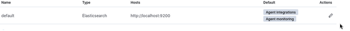

# TP Elastic ONAY ILKER RT3
<br>

## 1 Mise en place d'un environnement Elastic Security <br> <br>


<br> <br>
2 Configuration de fleet <br>
2.1 Configuration de l'url de fleet<br> 


2.2 Configuration des "outputs" de fleet
<br>On récupère nos certificats et les appliquent dans output
<br>
 <br>
 <br>
 <br>

<br>

<br>

# 4 Agent Elastic sur un poste Linux<br>
## 1 Installez l'agent Elastic sur un poste Linux (VM ou physique du CloudLab) et connectez-le à votre "fleet server" comme vous l'avez fait pour l'agent Windows. <br>

<br>

Je récupèrent mon certificat sur le poste linux et précise le chemin dans la dernière commandent <br>
````
$ curl -L -O https://artifacts.elastic.co/downloads/beats/elastic-agent/elastic-agent-7.17.15-linux-x86_64.tar.gz
$ tar xzvf elastic-agent-7.17.15-linux-x86_64.tar.gz

$ curl -L -O https://artifacts.elastic.co/downloads/beats/elastic-agent/elastic-agent-8.9.0-linux-x86_64.tar.gz
$ tar xzvf elastic-agent-8.9.0-linux-x86_64.tar.gz
$ cd elastic-agent-8.9.0-linux-x86_64
$ sudo ./elastic-agent install --url=https://10.202.0.72:8220 --enrollment-token=VEJSWTlvc0JvRTE5clA3UWF3amg6SjVQZDJyaDhTVC1CSWdZN2JSTVBiUQ== --certificate-authorities=/home/test/Bureau/ca.crt 


````


<br>
On voit qu’il remonte bien en “Healty”

<br>  
<br> 

## 2. Installez et visualisez les tableaux de bord produits par l'intégration "audit manager". (auditd ne doit pas être activé sur votre poste Linux).

apt-get install auditd <br>
service auditd status<br>
service auditd stop<br>
chkconfig auditd off<br>


<br>
Puis ajout depuis l'intégration


<br><br>  


On peut observer le bon fonctionnement, le script qui fait un cat de /etc/passwd renvoie bien les logs
<br>  

<br>
<br>
Le bon fonctionnement de sysmon


<br>
 


